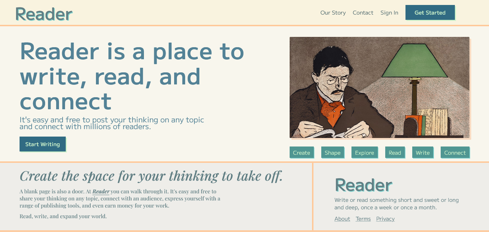
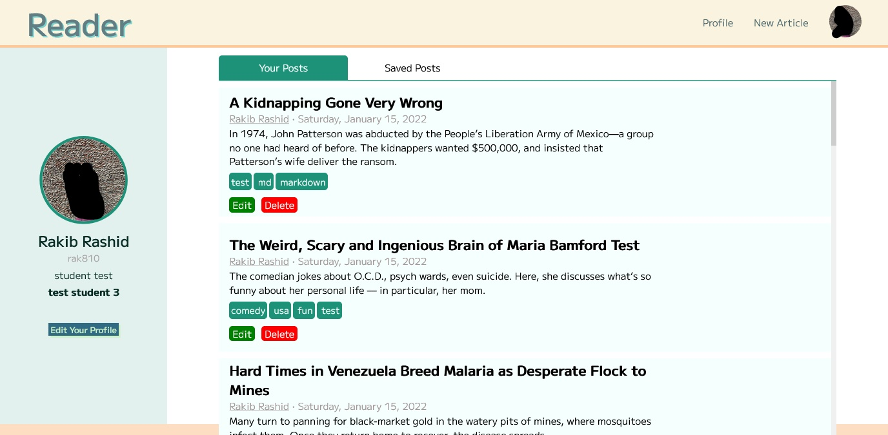
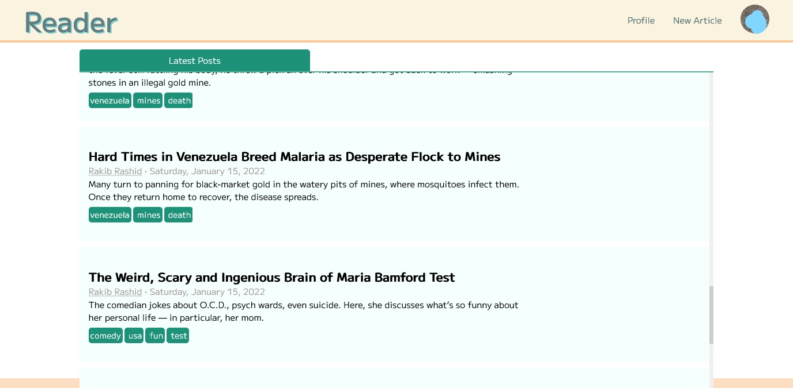
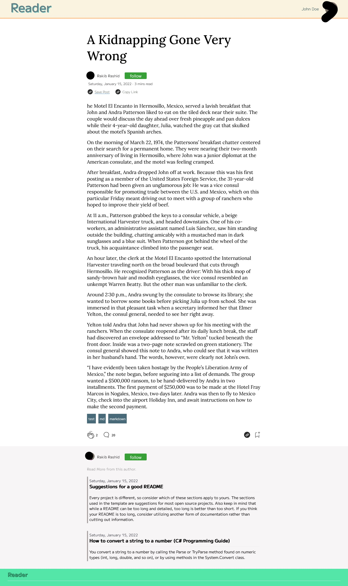

# Reader
This project is done as a requirement for web programming laboratory course.
It is based on *Medium*. The features of this application are following:
1. User can create an account and log into that account.
2. User with account can create, delete, and update post
3. Writing, editing posts suppost basic markdown
4. User with account can modify their profile
5. Non-users can reader can read posts written by the users.

ASP.NET Webforms, HTML, CSS, and Javascript was used to build the application.

Some screenshots of the application are following:
---
## Homepage of the application

## Profile of an user

## Latest posts on the application. Everyone can see these posts

## This a post made by an user. Post can be written in markdown

